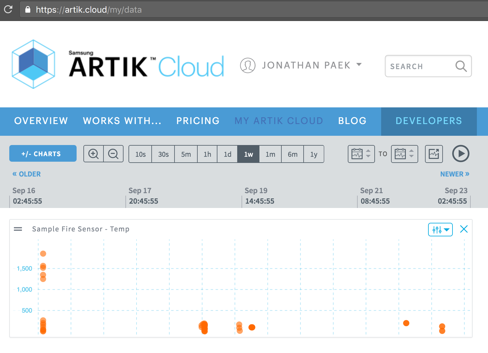

# MQTT client sample code in JavaScript

The sample code establishes a secure MQTT session with ARTIK Cloud, sends one message, and ends the session.

## Prerequisites
  - node
  - npm 

## Setup / Installation:
 1. Sign into [My ARTIK Cloud](https://artik.cloud/)
 2. On the device dashboard, click to connect a new device. Select the Demo Fire Sensor (from cloud.artik.sample.demofiresensor) and name your sensor SampleFireSensor (or any name you'd like).
 3. Click the Settings icon on the device you just added. Get the **device ID** and **device token**. If the token does not already exist, click "GENERATE DEVICE TOKEN…" to get one.
 4. Run the command to install packages:

  ```
  npm install
  ```

 5. Prepare source files. Rename **template_config.json** to **config.json**. Then copy the device ID and device token obtained before to config.json file.

## Run the application
%> node app.js

Here is the sample response:
```text
publishing data: {"temp":214}
publish path: /v1.1/messages/<redacted>
Use browser to see your data in realtime https://artik.cloud/my/data
```

## View your data in My ARTIK Cloud

Have you visited ARTIK Cloud [data visualization tool](https://artik.cloud/my/data)?

Select your device from the charts to view your device data in realtime. Run the application multiple times in your terminal, which sends a few random values. Here's a screenshot:



More about ARTIK Cloud
---------------

If you are not familiar with ARTIK Cloud, we have extensive documentation at https://developer.artik.cloud/documentation

The full ARTIK Cloud API specification can be found at https://developer.artik.cloud/documentation/api-reference/

Peek into advanced sample applications at https://developer.artik.cloud/documentation/samples/

To create and manage your services and devices on ARTIK Cloud, visit the Developer Dashboard at https://developer.artik.cloud

License and Copyright
---------------------

Licensed under the Apache License. See [LICENSE](LICENSE).

Copyright (c) 2016 Samsung Electronics Co., Ltd.

